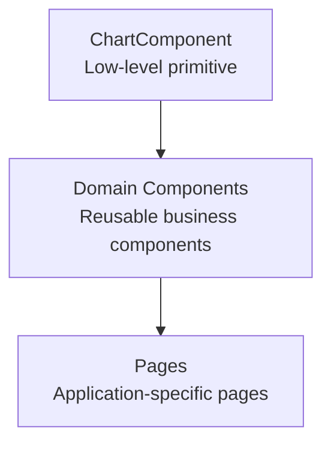
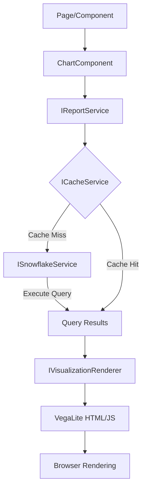

# SnowflakeProxy

A .NET library that provides declarative, component-based reporting capabilities for Blazor applications connected to Snowflake. Build interactive data visualizations with minimal code.

## Quick Start

### Installation

```bash
# Add the Core library for services
dotnet add package SnowflakeProxy.Core

# Add the Blazor library for components
dotnet add package SnowflakeProxy.Blazor
```

### Basic Setup

**1. Configure your Snowflake connection using environment variables:**

Copy the example environment file and configure your credentials:

```bash
cp example.env .env
# Edit .env with your Snowflake account details
```

Run the setup script to configure user secrets:

```bash
./tools/setup-secrets.sh
```

This securely stores credentials using .NET user secrets (not in source control). See `example.env` for all available configuration options.

You can also use user-secrets directly.

**2. Register services in `Program.cs`:**

```csharp
using SnowflakeProxy.Core.Services;
using SnowflakeProxy.Core.Models;

var builder = WebApplication.CreateBuilder(args);

// Configure Snowflake connection
builder.Services.Configure<SnowflakeConfiguration>(
    builder.Configuration.GetSection("Snowflake"));

// Register services
builder.Services.AddSingleton<ISnowflakeService, DirectSnowflakeService>();
builder.Services.AddSingleton<ICacheService, MemoryCacheService>();
builder.Services.AddSingleton<IVisualizationRenderer, VegaLiteRenderer>();
builder.Services.AddScoped<IReportService, DirectReportService>();

builder.Services.AddRazorComponents()
    .AddInteractiveServerComponents();

var app = builder.Build();
app.MapRazorComponents<App>()
    .AddInteractiveServerRenderMode();
app.Run();
```

**3. Import the namespace in `_Imports.razor`:**

```razor
@using SnowflakeProxy.Blazor.Components
```

**4. Use the component in your pages:**

```razor
@page "/reports"
@rendermode InteractiveServer

<h1>Sales Report</h1>

<ChartComponent
    Query="SELECT region, SUM(revenue) as total FROM sales GROUP BY region"
    ChartType="bar"
    ShowMetadata="true"
    CacheTtl="TimeSpan.FromMinutes(15)" />
```

## Usage Examples

### Ad-Hoc Queries with ChartComponent

The `ChartComponent` is a low-level primitive for executing inline SQL queries and rendering visualizations.

#### Table View

```razor
<ChartComponent
    Query="SELECT * FROM INFORMATION_SCHEMA.TABLES LIMIT 10"
    ChartType="table"
    ShowMetadata="true" />
```

#### Bar Chart

```razor
<ChartComponent
    Query="SELECT category, SUM(amount) as total FROM sales GROUP BY category"
    ChartType="bar" />
```

#### Line Chart

```razor
<ChartComponent
    Query="SELECT date, revenue FROM daily_sales ORDER BY date"
    ChartType="line" />
```

#### Custom VegaLite Specification

```razor
<ChartComponent
    Query="SELECT * FROM data"
    Spec="@(new {
        mark = "circle",
        encoding = new {
            x = new { field = "x_value", type = "quantitative" },
            y = new { field = "y_value", type = "quantitative" },
            size = new { field = "size_value", type = "quantitative" }
        }
    })" />
```

### Reusable Domain Components

Create custom components that wrap `ChartComponent` for domain-specific reports:

**EnrollmentStepsTable.razor:**

```razor
@using SnowflakeProxy.Core.Services
@using SnowflakeProxy.Core.Models

<ChartComponent
    Query="@QueryString"
    ChartType="table"
    ShowMetadata="@ShowMetadata"
    CacheTtl="@CacheTtl" />

@code {
    /// <summary>
    /// Number of enrollment steps to display
    /// </summary>
    [Parameter] public int Limit { get; set; } = 10;

    /// <summary>
    /// Show metadata (row count, cache status)
    /// </summary>
    [Parameter] public bool ShowMetadata { get; set; } = true;

    /// <summary>
    /// Cache TTL
    /// </summary>
    [Parameter] public TimeSpan? CacheTtl { get; set; } = TimeSpan.FromMinutes(10);

    private string QueryString => $"SELECT * FROM ENROLLMENTS LIMIT {Limit}";
}
```

**Usage:**

```razor
<EnrollmentStepsTable Limit="20" ShowMetadata="false" />
```

## ChartComponent API Reference

### Parameters

| Parameter      | Type        | Default | Description                                                            |
| -------------- | ----------- | ------- | ---------------------------------------------------------------------- |
| `Query`        | `string`    | `""`    | SQL query to execute against Snowflake                                 |
| `ChartType`    | `string`    | `"bar"` | Type of visualization: `"table"`, `"bar"`, `"line"`, `"area"`, `"pie"` |
| `Spec`         | `object?`   | `null`  | Custom VegaLite specification (overrides `ChartType`)                  |
| `ShowMetadata` | `bool`      | `false` | Show row count and cache status below the chart                        |
| `CacheTtl`     | `TimeSpan?` | `null`  | Cache duration (e.g., `TimeSpan.FromMinutes(10)`)                      |
| `Width`        | `int`       | `800`   | Chart width in pixels                                                  |
| `Height`       | `int`       | `400`   | Chart height in pixels                                                 |
| `Title`        | `string?`   | `null`  | Chart title                                                            |
| `XAxisLabel`   | `string?`   | `null`  | X-axis label                                                           |
| `YAxisLabel`   | `string?`   | `null`  | Y-axis label                                                           |

## Core Services

### ISnowflakeService

Handles connections and query execution against Snowflake.

```csharp
public interface ISnowflakeService
{
    Task<DataTable> ExecuteQueryAsync(string query, CancellationToken cancellationToken = default);
}
```

**Implementations:**

- `DirectSnowflakeService` - Direct connection to Snowflake (Phase 1)
- `MockSnowflakeService` - Mock service for testing

### IReportService

Orchestrates report generation with caching and visualization.

```csharp
public interface IReportService
{
    Task<ReportResult> GenerateReportAsync(
        ReportConfig config,
        CancellationToken cancellationToken = default);
}
```

**Implementations:**

- `DirectReportService` - Synchronous report generation (Phase 1)

### IVisualizationRenderer

Transforms data into visual representations.

```csharp
public interface IVisualizationRenderer
{
    Task<string> RenderAsync(
        DataTable data,
        VisualizationConfig config,
        CancellationToken cancellationToken = default);
}
```

**Implementations:**

- `VegaLiteRenderer` - Generates VegaLite specifications for interactive charts

### ICacheService

Provides caching for query results.

```csharp
public interface ICacheService
{
    Task<T?> GetAsync<T>(string key, CancellationToken cancellationToken = default);
    Task SetAsync<T>(string key, T value, TimeSpan? ttl = null, CancellationToken cancellationToken = default);
}
```

**Implementations:**

- `MemoryCacheService` - In-memory caching with TTL support

## Project Structure

```mermaid
graph TD
    Root[SnowflakeProxy/]

    Root --> Core[SnowflakeProxy.Core/<br/>Framework-agnostic business logic]
    Core --> CoreModels[Models/]
    Core --> CoreServices[Services/]
    Core --> CoreExtensions[Extensions/]

    CoreModels --> ReportConfig[ReportConfig.cs]
    CoreModels --> VisualizationConfig[VisualizationConfig.cs]
    CoreModels --> ReportResult[ReportResult.cs]
    CoreModels --> SnowflakeConfig[SnowflakeConfiguration.cs]

    CoreServices --> ISnowflakeService[ISnowflakeService.cs]
    CoreServices --> IReportService[IReportService.cs]
    CoreServices --> IVisualizationRenderer[IVisualizationRenderer.cs]
    CoreServices --> ICacheService[ICacheService.cs]
    CoreServices --> DirectSnowflake[DirectSnowflakeService.cs]
    CoreServices --> DirectReport[DirectReportService.cs]
    CoreServices --> VegaLite[VegaLiteRenderer.cs]
    CoreServices --> MemoryCache[MemoryCacheService.cs]
    CoreServices --> MockSnowflake[MockSnowflakeService.cs]

    CoreExtensions --> DataTableExt[DataTableExtensions.cs]

    Root --> Blazor[SnowflakeProxy.Blazor/<br/>Blazor components]
    Blazor --> Components[Components/]
    Blazor --> Wwwroot[wwwroot/]

    Components --> ChartComponent[ChartComponent.razor]
    Components --> EnrollmentTable[EnrollmentStepsTable.razor]

    Wwwroot --> SnowflakeJS[snowflake-reporting.js]

    Root --> Sample[SnowflakeProxy.Sample.Server/<br/>Sample Blazor Server app]
    Sample --> SampleComponents[Components/]
    Sample --> ProgramCS[Program.cs]

    SampleComponents --> Pages[Pages/]
    SampleComponents --> Layout[Layout/]

    Pages --> Reports[Reports.razor]
    Pages --> CustomReports[CustomReports.razor]

    Root --> Tests[SnowflakeProxy.Core.Tests/<br/>Unit tests]
```



## Development Roadmap

### Phase 1: Foundation (Blazor Server) ✅ COMPLETE

- [x] Core interfaces and abstractions
- [x] Direct Snowflake connectivity
- [x] Basic Blazor components (`ChartComponent`)
- [x] VegaLite visualization pipeline
- [x] In-memory caching
- [x] Sample Blazor Server application

### Phase 2: HTTP API Layer (Planned)

- [ ] Role-based access control
- [ ] RESTful API endpoints
- [ ] HTTP client implementations
- [ ] Blazor WebAssembly support
- [ ] Distributed caching (Redis)

### Phase 3: Enhanced Rendering & SSR (Planned)

- [ ] Python visualization renderer (matplotlib, plotly, seaborn)
- [ ] Static site generation support
- [ ] Multi-tier caching
- [ ] Background report pre-computation

### Phase 4: Enterprise & Ecosystem (Planned)

- [ ] Parquet serialization for efficient data transfer
- [ ] Visual report designer UI
- [ ] Audit logging and monitoring
- [ ] Plugin architecture
- [ ] Additional data source support

## Architecture

### Component Hierarchy



**ChartComponent**: Accepts inline SQL queries and renders visualizations. Use this for ad-hoc analysis and quick reports.

**Domain Components**: Wrap `ChartComponent` with domain-specific logic, parameter validation, and default settings. Use this for reusable, parameterized reports.

### Data Flow



## Performance Considerations

### Caching

- **Default**: No caching
- **Enabled**: Set `CacheTtl` parameter
- **Cache Key**: Generated from query + parameters
- **Implementation**: In-memory (Phase 1), Redis (Phase 2+)

```razor
<!-- Cache for 10 minutes -->
<ChartComponent
    Query="SELECT * FROM sales"
    CacheTtl="TimeSpan.FromMinutes(10)" />
```

### Query Optimization

1. **Use LIMIT**: Constrain result sets for large tables
2. **Aggregate Early**: Perform aggregations in SQL, not in memory
3. **Index Aware**: Structure queries to use Snowflake's clustering keys
4. **Warehouse Sizing**: Use appropriate warehouse size for query complexity

## Testing

### Mock Service for Testing

Use `MockSnowflakeService` for unit testing without Snowflake connection:

```csharp
// In your test setup
services.AddSingleton<ISnowflakeService>(sp =>
{
    var mockService = new MockSnowflakeService();
    mockService.AddMockData("SELECT * FROM test", CreateTestDataTable());
    return mockService;
});
```

### Running Tests

```bash
cd SnowflakeProxy.Core.Tests
dotnet test
```

## Examples

See the `SnowflakeProxy.Sample.Server` project for complete working examples:

- **`/reports`**: Ad-hoc queries using `ChartComponent`
- **`/custom-reports`**: Reusable domain components

Run the sample app:

```bash
cd SnowflakeProxy.Sample.Server
dotnet run
```

Navigate to `https://localhost:5001` (or the URL shown in the console).