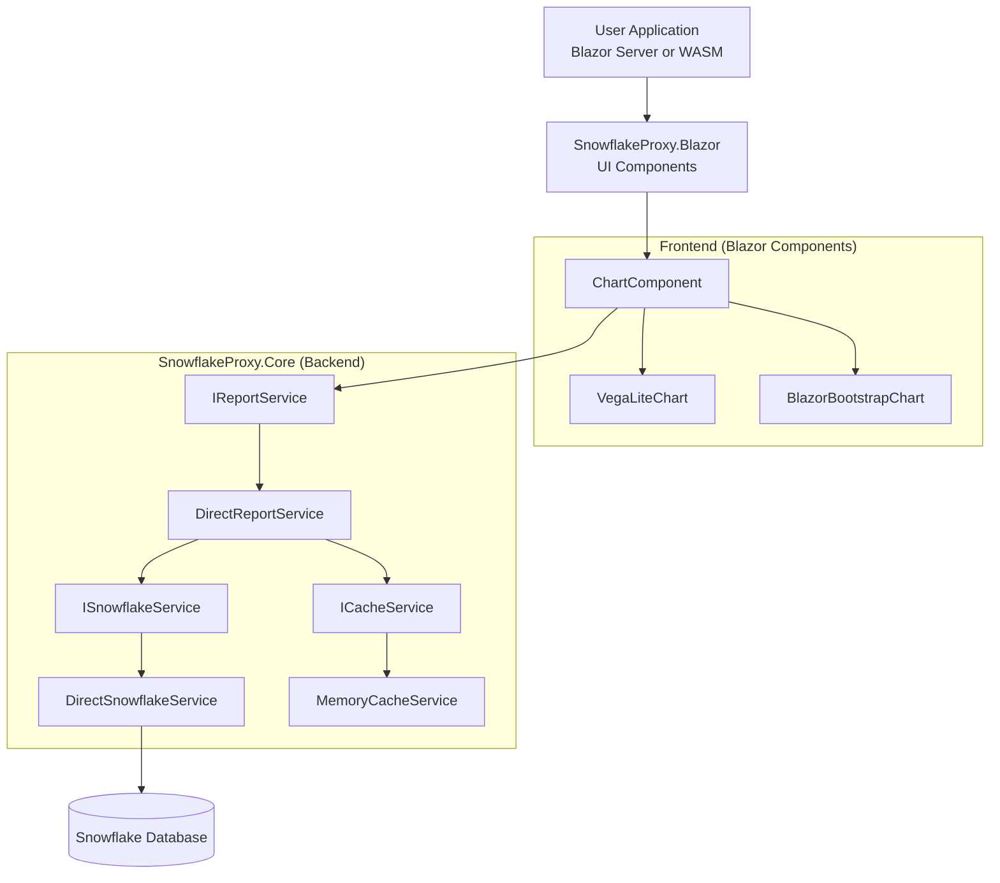
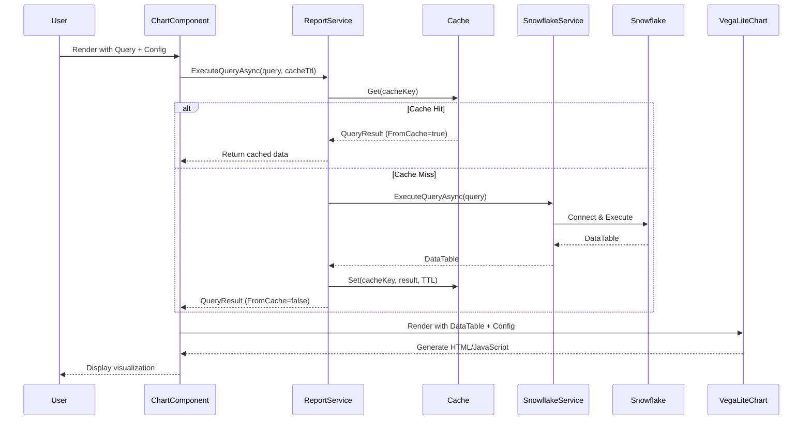
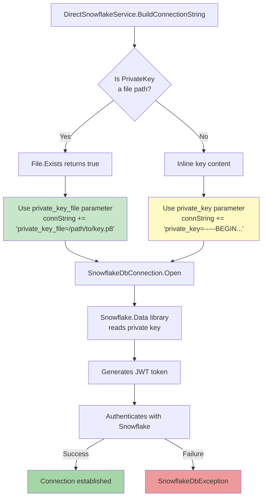

# SnowflakeProxy Architecture Guide

**Last Updated:** 2025-11-03

This document provides a comprehensive overview of the SnowflakeProxy/SnowflakeReporting library architecture, explaining what each file does and how everything fits together.

---

## 📁 Project Structure Overview

```
SnowflakeProxy/
├── SnowflakeProxy.Core/          # Core library (business logic)
├── SnowflakeProxy.Blazor/         # Blazor UI components
├── SnowflakeProxy.Core.Tests/     # Unit & integration tests
├── SnowflakeProxy.Sample.Server/  # Demo Blazor Server app
├── tools/                         # Developer utilities
└── docs/                          # Documentation
```

---

## 🎯 High-Level Architecture



### Report Generation Flow



---

## 📦 SnowflakeProxy.Core

**Purpose:** The main library containing all business logic, data access, and visualization rendering.

**Target Framework:** .NET 8.0 (for broad compatibility)

### Core Interfaces (`Services/`)

#### `ISnowflakeService.cs`

- **What:** Contract for executing Snowflake queries
- **Why:** Abstraction allows swapping implementations (real vs mock)
- **Key Method:** `Task<DataTable> ExecuteQueryAsync(string query, ...)`

#### `IReportService.cs`

- **What:** Contract for executing queries with caching
- **Why:** Simplified API focused on data retrieval; visualization happens in frontend components
- **Key Method:** `Task<QueryResult> ExecuteQueryAsync(string query, Dictionary<string, object>? parameters = null, TimeSpan? cacheTtl = null)`
- **Note:** No longer handles visualization rendering - that's handled by Blazor components

#### `ICacheService.cs`

- **What:** Contract for caching query results
- **Why:** Abstraction allows different cache backends (memory, Redis, etc.)
- **Key Methods:** `Get()`, `Set()`, `Remove()`

### Core Implementations

#### `DirectSnowflakeService.cs` ⭐ IMPORTANT

- **What:** Connects to Snowflake using private key authentication
- **How:**
  1. Builds connection string with JWT auth (`authenticator=snowflake_jwt`)
  2. Detects if PrivateKey is file path or content
  3. Uses `private_key_file` parameter for file paths (simpler!)
  4. Uses `private_key` parameter for inline content (deployment)
  5. Opens connection, executes query, returns DataTable
- **Dependencies:**
  - `Snowflake.Data` NuGet package (v4.1.0)
  - `SnowflakeConfiguration` model
  - `ILogger<DirectSnowflakeService>`
- **Key Features:**
  - Comprehensive structured logging at Debug level
  - Parameter binding support
  - Detailed error messages with Snowflake error codes
  - Connection pooling configured via config

#### `MockSnowflakeService.cs`

- **What:** Fake Snowflake service for testing without credentials
- **How:**
  1. Analyzes query text for patterns (sales, users, time-series, etc.)
  2. Generates realistic fake data matching the pattern
  3. Returns mock DataTable with appropriate columns/rows
- **Why:** Enables full integration testing without Snowflake instance
- **Use Cases:**
  - CI/CD pipelines
  - Local development without VPN
  - Demo environments

#### `DirectReportService.cs`

- **What:** Orchestrates query execution + caching
- **How:**
  1. Generates cache key from query hash (SHA256)
  2. Checks cache for existing result
  3. If miss, executes query via ISnowflakeService
  4. Stores DataTable in cache with TTL
  5. Returns QueryResult (data + metadata)
- **Dependencies:**
  - `ISnowflakeService`
  - `ICacheService`
  - `ILogger<DirectReportService>`
- **Note:** No longer handles visualization - frontend components handle that

#### `MemoryCacheService.cs`

- **What:** In-memory cache implementation
- **How:** Wraps `IMemoryCache` from Microsoft.Extensions.Caching
- **TTL:** Respects `CacheTtl` from ReportConfig
- **Eviction:** LRU when memory pressure occurs

### Models (`Models/`)

#### `SnowflakeConfiguration.cs`

```csharp
public record SnowflakeConfiguration
{
    public string Account { get; init; }          // e.g. "ORGNAME-ACCOUNT123"
    public string User { get; init; }             // e.g. "john.doe@company.com"
    public string PrivateKey { get; init; }       // File path OR key content
    public string PrivateKeyPassword { get; init; }
    public string Warehouse { get; init; }
    public string Database { get; init; }
    public string Schema { get; init; }
    public string Role { get; init; }
    public string Application { get; init; } = "SnowflakeReporting";
    public int ConnectionTimeout { get; init; } = 60;
    public int CommandTimeout { get; init; } = 300;
    public int MaxPoolSize { get; init; } = 10;
    public int MinPoolSize { get; init; } = 2;
}
```

#### `QueryResult.cs`

```csharp
public record QueryResult
{
    public DataTable Data { get; init; } = new();     // Query results
    public bool FromCache { get; init; }              // Cache hit indicator
    public DateTime ExecutedAt { get; init; } = DateTime.UtcNow;
}
```

**Note:** Simplified from old `ReportResult` - no longer includes rendered output since visualization happens in frontend.

#### `VisualizationConfig.cs`

```csharp
public record VisualizationConfig
{
    public string Type { get; init; } = "table";  // bar, line, pie, scatter, etc.
    public string? Title { get; init; }
    public int? Width { get; init; }
    public int? Height { get; init; }
    public string? XAxis { get; init; }           // Column name for X axis
    public string? YAxis { get; init; }           // Column name for Y axis
    public string? ColorField { get; init; }      // Column for color encoding
    public object? Spec { get; init; }            // Renderer-specific config (Vega-Lite spec, ChartOptions, etc.)
}
```

**Note:** `Spec` property provides flexibility for renderer-specific configuration. Vega-Lite renderer expects Vega-Lite JSON spec; Blazor Bootstrap renderer expects ChartOptions objects.

### Extensions (`Extensions/`)

#### `ServiceCollectionExtensions.cs`

- **What:** Dependency injection registration helpers
- **Methods:**
  1. `AddSnowflakeReporting(IConfiguration, string)` - Reads config from appsettings.json
  2. `AddSnowflakeReporting(SnowflakeConfiguration)` - Direct config object
  3. `AddSnowflakeReportingWithMockData()` - Uses MockSnowflakeService
- **Registers:**
  - `IMemoryCache` → `MemoryCacheService`
  - `ICacheService` → `MemoryCacheService`
  - `ISnowflakeService` → `DirectSnowflakeService` (or Mock)
  - `IReportService` → `DirectReportService`
- **Note:** No longer registers visualization renderers - rendering is handled by frontend components

---

## 🧪 SnowflakeProxy.Core.Tests

**Purpose:** Unit and integration tests

**Target Framework:** .NET 9.0

**Test Libraries:**

- xUnit (test framework)
- Moq (mocking)
- FluentAssertions (readable assertions)

### Test Organization

```
Tests/
├── Unit/
│   ├── MemoryCacheServiceTests.cs    # Cache behavior
│   ├── VegaLiteRendererTests.cs      # Visualization rendering
│   └── MockSnowflakeServiceTests.cs  # Mock data generation
└── Integration/
    └── EndToEndIntegrationTests.cs   # Full stack with mock data
```

### `EndToEndIntegrationTests.cs` ⭐ IMPORTANT

- **What:** Tests entire flow without real Snowflake
- **Setup:**
  ```csharp
  services.AddSnowflakeReportingWithMockData();
  _reportService = serviceProvider.GetRequiredService<IReportService>();
  ```
- **Tests:**
  - Table reports
  - Bar charts
  - Line charts
  - Pie charts
  - Scatter plots
  - Custom queries
  - Caching behavior
  - Parameter binding
  - Error handling
  - Concurrent requests
- **Status:** 52 passing, 2 failing (non-blocking JSON edge cases)

---

## 🎨 SnowflakeProxy.Blazor

**Purpose:** Reusable Blazor components for rendering visualizations from Snowflake data

**Target Framework:** .NET 8.0

**Architecture:** Component-based rendering (no backend renderer services)

### Component Hierarchy

```
ChartComponent (wrapper)
├── Fetches data via IReportService
├── Handles loading/error states
└── Delegates rendering to:
    ├── VegaLiteChart (Vega-Lite renderer)
    └── BlazorBootstrapChart (Chart.js via Blazor Bootstrap)
```

### Core Components

#### `ChartComponent.razor` ⭐ PRIMARY

- **What:** Convenience wrapper that fetches data and delegates to chart renderers
- **Parameters:**
  - `Query` (required): SQL query to execute
  - `Config`: VisualizationConfig object (Type, Title, Width, Height, Spec, etc.)
  - `Renderer`: "vega-lite" or "blazor-bootstrap" (default: "vega-lite")
  - `CacheTtl`: Optional cache duration
  - `ShowMetadata`: Show row count and cache status
  - `Parameters`: Query parameters dictionary
- **Features:**
  - Automatic loading indicator
  - Error handling with retry button
  - Cache status display
  - Custom loading/error content via RenderFragments
  - Event callbacks (OnLoading, OnLoaded, OnError)
- **Usage Example:**

```csharp
<ChartComponent
    Query="SELECT region, revenue FROM sales"
    Config="@(new VisualizationConfig { Type = "bar", Title = "Sales by Region" })"
    Renderer="vega-lite"
    ShowMetadata="true"
    CacheTtl="TimeSpan.FromMinutes(10)" />
```

#### `VegaLiteChart.razor`

- **What:** Renders DataTable as Vega-Lite visualization
- **Parameters:**
  - `Data` (required): DataTable to visualize
  - `Config` (required): VisualizationConfig
- **How:**
  1. Converts DataTable to JSON array
  2. Generates Vega-Lite spec from Config (or uses custom Spec if provided)
  3. Returns HTML with embedded vegaEmbed() call
- **Supported Chart Types:**
  - `table`: HTML table
  - `bar`: Bar chart
  - `line`: Line chart (with points)
  - `pie`: Pie chart (arc mark)
  - `scatter`/`point`: Scatter plot
  - `area`: Area chart
- **Custom Specs:** If `Config.Spec` is provided, uses it directly (allows full Vega-Lite control)
- **Note:** Requires vega-embed JavaScript library in your app

#### `BlazorBootstrapChart.razor`

- **What:** Renders DataTable using Blazor Bootstrap charts (Chart.js wrapper)
- **Parameters:**
  - `Data` (required): DataTable to visualize
  - `Config` (required): VisualizationConfig
- **How:**
  1. Converts DataTable to ChartData format
  2. Dynamically instantiates appropriate Blazor Bootstrap component
  3. Calls InitializeAsync() in OnAfterRenderAsync
- **Supported Chart Types:**
  - `table`: HTML table
  - `bar`: BarChart
  - `line`: LineChart
  - `pie`: PieChart
  - `doughnut`: DoughnutChart
  - `polararea`: PolarAreaChart
- **Note:** Uses imperative API (InitializeAsync) due to Blazor Bootstrap design

#### Domain-Specific Components (Examples)

##### `EnrollmentStepsChart.razor`

- **What:** Pre-configured chart for enrollment funnel analysis
- **Parameters:**
  - `EnrollmentPackageId`: Package ID to filter
  - `ShowMetadata`: Show metadata
  - `CacheTtl`: Cache duration
- **Implementation:** Wraps ChartComponent with hardcoded query + Vega-Lite spec
- **Purpose:** Demonstrates how to create domain-specific components for common reports

### Supporting Components

#### `SnowflakeProxyScripts.razor`

- **What:** Includes required JavaScript libraries (Vega-Lite, Vega-Embed)
- **Usage:** Add once to your App.razor or layout

```csharp
<SnowflakeProxyScripts />
```

### `_Imports.razor`

Global using statements for all Blazor components:

```csharp
@using Microsoft.AspNetCore.Components.Web
@using SnowflakeProxy.Core.Models
@using SnowflakeProxy.Core.Services
```

### Design Principles

1. **Separation of Concerns:** Backend returns data, frontend handles visualization
2. **Component Hierarchy:** Idiomatic Blazor pattern (components rendering components)
3. **Flexibility:** Support both simple configs and advanced custom specs
4. **Multiple Renderers:** Vega-Lite for declarative specs, Blazor Bootstrap for Chart.js
5. **Reusability:** Domain-specific components wrap generic ChartComponent

---

## 🚀 SnowflakeProxy.Sample.Server

**Purpose:** Demo Blazor Server application

**Target Framework:** .NET 9.0

### Key Files

#### `Program.cs`

```csharp
var builder = WebApplication.CreateBuilder(args);

builder.Services.AddRazorComponents()
    .AddInteractiveServerComponents();

// Add Blazor Bootstrap (for BlazorBootstrapChart component)
builder.Services.AddBlazorBootstrap();

// Register SnowflakeReporting with config from User Secrets
builder.Services.AddSnowflakeReporting(builder.Configuration, "Snowflake");

var app = builder.Build();
// ... middleware setup
app.Run();
```

**Note:** No renderer services registered - visualization handled by components

#### `appsettings.json`

```json
{
  "Logging": {
    "LogLevel": {
      "Default": "Information",
      "Microsoft.AspNetCore": "Warning",
      "SnowflakeProxy": "Debug" // Detailed logging for our library
    }
  },
  "Snowflake": {
    "Account": "YOUR_ACCOUNT", // Placeholder - use User Secrets!
    "Application": "SnowflakeReportingSample",
    "ConnectionTimeout": 60,
    "CommandTimeout": 300,
    "MaxPoolSize": 10,
    "MinPoolSize": 2
  }
}
```

#### `Components/Pages/Reports.razor` ⭐ IMPORTANT

- **What:** Interactive demo page showing library capabilities
- **Render Mode:** `@rendermode InteractiveServer` (enables button clicks)
- **Features:**
  1. **Connection Test:** Displays current warehouse/database/schema info
  2. **Custom Query Builder:** Dynamic query executor with chart type selector
  3. **Vega-Lite Examples:** Demonstrates declarative visualization grammar
  4. **Blazor Bootstrap Examples:** Demonstrates Chart.js-based charts
  5. **Renderer Comparison:** Same data with different renderers
- **State Management:**
  - Uses `StateHasChanged()` to force component re-renders
  - Automatic loading indicators via ChartComponent
  - Error handling with retry functionality
  - Cache status and row count metadata display
- **Usage Example:**

```csharp
<ChartComponent
    Query="@customQuery"
    Config="@(new VisualizationConfig { Type = customChartType })"
    Renderer="vega-lite"
    ShowMetadata="true"
    CacheTtl="TimeSpan.FromMinutes(5)" />
```

#### `Components/Layout/NavMenu.razor`

- Added "Reports" link with graph icon

---

## 🛠️ Tools

### `tools/setup-secrets.sh` ⭐ CRITICAL

- **What:** Bash script to configure User Secrets from `.env` file
- **Why:** User Secrets is Microsoft's recommended way for local dev credentials
- **How:**
  1. Sources `.env` file
  2. Validates required variables exist
  3. Reads private key file path from `SNOWFLAKE_PRIVATE_KEY_PATH`
  4. Stores file PATH (not content) in User Secrets as `Snowflake:PrivateKey`
  5. Stores all other config values
- **Usage:** `./tools/setup-secrets.sh`
- **Location:** User Secrets stored in `~/.microsoft/usersecrets/{guid}/secrets.json`

### `tools/TestSnowflakeConnection.cs`

- **What:** Simple console app to verify Snowflake credentials
- **Why:** Quick way to test connection without running full Blazor app
- **Usage:** `cd tools && dotnet run <account> <user> <keyfile> <password>`
- **Proved:** `private_key_file` parameter works correctly

---

## 📄 Documentation

### `docs/development_plan.md`

Original 3-phase plan document (baseline)

### `docs/executive_summary.md`

Business-level overview of the project

### `docs/code_review_summary.md`

Comprehensive 8-page technical review with ratings

### `docs/memory.md`

Development session notes and findings

### `docs/ARCHITECTURE.md` (this file!)

Complete codebase walkthrough

---

## 🔑 Key Concepts

### 1. Private Key Authentication



**Snowflake.Data Library Requirements:**

- Use `authenticator=snowflake_jwt` in connection string
- Two approaches:
  1. **File Path (Local Dev):** `private_key_file=/path/to/key.p8` ✅ SIMPLER
  2. **Inline Content (Deployment):** `private_key=-----BEGIN...` ⚠️ COMPLEX

**DirectSnowflakeService Implementation:**

```csharp
bool isFilePath = File.Exists(_config.PrivateKey);

if (isFilePath)
    connString += $"private_key_file={_config.PrivateKey};";
else
    connString += $"private_key={_config.PrivateKey};";  // Requires escaping!
```

### 2. Configuration Strategy

**Local Development:**

- Store credentials in **User Secrets** (never in git)
- Use `tools/setup-secrets.sh` to populate from `.env`
- Store private key **file path** in User Secrets

**Production Deployment:**

- Use **Environment Variables** or **Azure Key Vault**
- Store private key **content** (not file path)
- Ensure proper newline escaping: `\n` → `\\n` in JSON

### 3. Caching Architecture

**Cache Key Generation:**

```csharp
string cacheKey = config.ReportId ??
    $"report:{Convert.ToBase64String(SHA256.HashData(Encoding.UTF8.GetBytes(config.Query)))}";
```

**Cache Flow:**

1. Check `ICacheService.Get<ReportResult>(cacheKey)`
2. If hit, return immediately with `FromCache = true`
3. If miss, execute query + render visualization
4. Store in cache: `ICacheService.Set(cacheKey, result, config.CacheTtl)`
5. Return with `FromCache = false`

**Benefits:**

- Reduces Snowflake query costs
- Faster response times for repeated queries
- Configurable TTL per report

### 4. Visualization Rendering (Component-Based)

**Architecture:** Rendering happens entirely in Blazor components (frontend), not backend services.

**Data Flow:**

```
Backend (IReportService) → QueryResult (DataTable)
  → ChartComponent → VegaLiteChart/BlazorBootstrapChart
  → Generated HTML/JavaScript
```

**VegaLiteChart Example Output:**

```html
<div id="vis-abc123"></div>
<script type="text/javascript">
  (function() {
    var spec = {
      "$schema": "https://vega.github.io/schema/vega-lite/v5.json",
      "data": {"values": [{"region":"West","revenue":5000}, ...]},
      "mark": "bar",
      "encoding": {
        "x": {"field": "region", "type": "nominal"},
        "y": {"field": "revenue", "type": "quantitative"}
      },
      "width": 600,
      "height": 400
    };
    vegaEmbed('#vis-abc123', spec, {actions: false, renderer: 'svg'});
  })();
</script>
```

**BlazorBootstrapChart Process:**

1. Component converts DataTable to ChartData format
2. Instantiates appropriate Blazor Bootstrap component (BarChart, LineChart, etc.)
3. Calls InitializeAsync() with ChartData and ChartOptions
4. Chart.js renders the visualization

**Benefits of Component Approach:**

- Proper separation of concerns (backend = data, frontend = presentation)
- Frontend can refresh visualizations without re-querying data
- Support for multiple renderers without backend changes
- Easier to add new chart types (just add new components)
- Configuration stays with component code (not stored in database)

### 5. Dependency Injection Pattern

**Why Interfaces:**

- Testability: Swap real implementations for mocks
- Flexibility: Support multiple backends (Snowflake, BigQuery, etc.)
- Separation of Concerns: Business logic decoupled from infrastructure

**Registration:**

```csharp
// Production
services.AddSnowflakeReporting(configuration, "Snowflake");

// Testing
services.AddSnowflakeReportingWithMockData();
```

---

## 🏗️ Build & Run

### Prerequisites

- .NET 8 SDK (for Core library)
- .NET 9 SDK (for Sample app & tests)
- Snowflake account with private key auth configured

### Setup Steps

1. **Clone & Restore:**

   ```bash
   git clone <repo>
   cd SnowflakeProxy
   dotnet restore
   ```

2. **Configure Credentials:**

   ```bash
   # Edit .env file with your Snowflake details
   nano .env

   # Run setup script
   ./tools/setup-secrets.sh
   ```

3. **Run Tests:**

   ```bash
   cd SnowflakeProxy.Core.Tests
   dotnet test
   # Expected: 52 passed, 2 failed (non-blocking)
   ```

4. **Run Sample App:**
   ```bash
   cd SnowflakeProxy.Sample.Server
   dotnet run
   # Open https://localhost:5001/reports
   ```

---

## 🐛 Common Issues & Solutions

### Issue: "Could not read private key"

**Cause:** Escaping problems with inline key content
**Solution:** Use file path approach with `private_key_file` parameter

### Issue: Buttons don't work in Blazor

**Cause:** Page not using `@rendermode InteractiveServer`
**Solution:** Add directive and ensure page is in `Components/Pages/` folder

### Issue: Tests fail with Snowflake connection errors

**Cause:** Using real SnowflakeService in tests
**Solution:** Use `AddSnowflakeReportingWithMockData()` instead

### Issue: Cache not working

**Cause:** ReportId not set, query hash changing
**Solution:** Set explicit `ReportId` in ReportConfig for consistent caching

---

## 📈 Future Enhancements

### Phase 2 (Planned)

- [ ] JavaScript/TypeScript library for non-Blazor apps
- [ ] Additional visualization renderers (Chart.js, Plotly)
- [ ] Redis cache backend
- [ ] Query parameter validation
- [ ] Rate limiting

### Phase 3 (Nice-to-Have)

- [ ] Real-time streaming queries
- [ ] Export to PDF/Excel
- [ ] Scheduled report generation
- [ ] Multi-tenant support
- [ ] Admin dashboard

---

## 🤝 Contributing

### Code Style

- Use C# 12 features (records, pattern matching, etc.)
- Follow Microsoft naming conventions
- Add XML documentation to all public APIs
- Include structured logging at appropriate levels

### Testing Requirements

- Unit tests for all service implementations
- Integration tests for end-to-end flows
- Mock Snowflake service for CI/CD pipelines
- Minimum 80% code coverage goal

### Pull Request Checklist

- [ ] All tests pass (`dotnet test`)
- [ ] No compiler warnings
- [ ] XML documentation added
- [ ] ARCHITECTURE.md updated if needed
- [ ] Sample app demonstrates new feature

---

## 📞 Support

**Issues:** Report bugs at GitHub Issues
**Questions:** Check `docs/` folder first
**Security:** Report vulnerabilities privately to maintainers

---

## 📄 License

[License info here]

---

**Generated by Claude Code** 🤖
_Making Snowflake data accessible to everyone_
