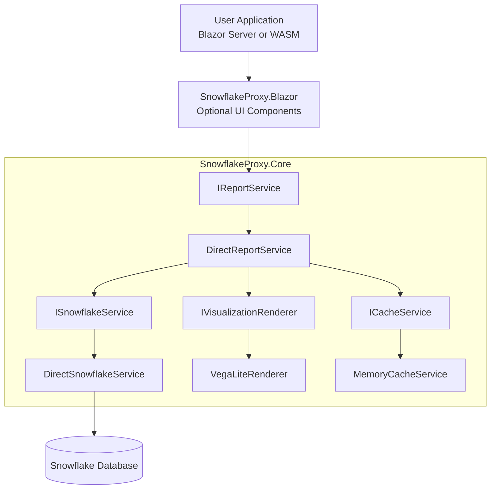
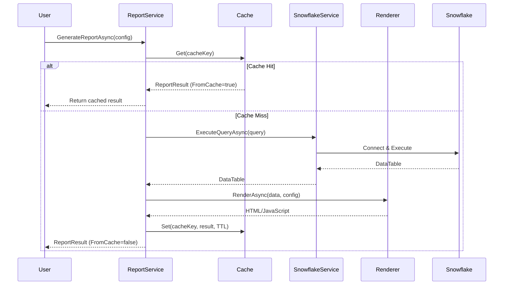

# SnowflakeProxy Architecture Guide

**Last Updated:** 2025-10-10

This document provides a comprehensive overview of the SnowflakeProxy/SnowflakeReporting library architecture, explaining what each file does and how everything fits together.

---

## 📁 Project Structure Overview

```
SnowflakeProxy/
├── SnowflakeProxy.Core/          # Core library (business logic)
├── SnowflakeProxy.Blazor/         # Blazor UI components
├── SnowflakeProxy.Core.Tests/     # Unit & integration tests
├── SnowflakeProxy.Sample.Server/  # Demo Blazor Server app
├── tools/                         # Developer utilities
└── docs/                          # Documentation
```

---

## 🎯 High-Level Architecture



### Report Generation Flow



---

## 📦 SnowflakeProxy.Core

**Purpose:** The main library containing all business logic, data access, and visualization rendering.

**Target Framework:** .NET 8.0 (for broad compatibility)

### Core Interfaces (`Services/`)

#### `ISnowflakeService.cs`
- **What:** Contract for executing Snowflake queries
- **Why:** Abstraction allows swapping implementations (real vs mock)
- **Key Method:** `Task<DataTable> ExecuteQueryAsync(string query, ...)`

#### `IReportService.cs`
- **What:** Contract for generating complete reports
- **Why:** High-level API that combines query + visualization + caching
- **Key Method:** `Task<ReportResult> GenerateReportAsync(ReportConfig config)`

#### `IVisualizationRenderer.cs`
- **What:** Contract for rendering visualizations
- **Why:** Abstraction allows multiple rendering engines (Vega-Lite, Chart.js, etc.)
- **Key Method:** `Task<string> RenderAsync(DataTable data, VisualizationConfig config)`

#### `ICacheService.cs`
- **What:** Contract for caching query results
- **Why:** Abstraction allows different cache backends (memory, Redis, etc.)
- **Key Methods:** `Get()`, `Set()`, `Remove()`

### Core Implementations

#### `DirectSnowflakeService.cs` ⭐ IMPORTANT
- **What:** Connects to Snowflake using private key authentication
- **How:**
  1. Builds connection string with JWT auth (`authenticator=snowflake_jwt`)
  2. Detects if PrivateKey is file path or content
  3. Uses `private_key_file` parameter for file paths (simpler!)
  4. Uses `private_key` parameter for inline content (deployment)
  5. Opens connection, executes query, returns DataTable
- **Dependencies:**
  - `Snowflake.Data` NuGet package (v4.1.0)
  - `SnowflakeConfiguration` model
  - `ILogger<DirectSnowflakeService>`
- **Key Features:**
  - Comprehensive structured logging at Debug level
  - Parameter binding support
  - Detailed error messages with Snowflake error codes
  - Connection pooling configured via config

#### `MockSnowflakeService.cs`
- **What:** Fake Snowflake service for testing without credentials
- **How:**
  1. Analyzes query text for patterns (sales, users, time-series, etc.)
  2. Generates realistic fake data matching the pattern
  3. Returns mock DataTable with appropriate columns/rows
- **Why:** Enables full integration testing without Snowflake instance
- **Use Cases:**
  - CI/CD pipelines
  - Local development without VPN
  - Demo environments

#### `DirectReportService.cs`
- **What:** Orchestrates query execution + visualization + caching
- **How:**
  1. Checks cache for existing result (using ReportId + Query hash)
  2. If miss, executes query via ISnowflakeService
  3. Renders visualization via IVisualizationRenderer
  4. Stores in cache with TTL
  5. Returns ReportResult
- **Dependencies:**
  - `ISnowflakeService`
  - `IVisualizationRenderer`
  - `ICacheService`
  - `ILogger<DirectReportService>`

#### `VegaLiteRenderer.cs`
- **What:** Generates HTML/JavaScript using Vega-Lite library
- **How:**
  1. Converts DataTable to JSON array of objects
  2. Builds Vega-Lite spec based on VisualizationConfig
  3. Returns HTML with embedded `<script>` tag calling vegaEmbed()
- **Supported Chart Types:**
  - Table (raw HTML table)
  - Bar chart
  - Line chart
  - Pie chart
  - Scatter plot
- **Note:** Requires `vega-embed` JavaScript library in your HTML

#### `MemoryCacheService.cs`
- **What:** In-memory cache implementation
- **How:** Wraps `IMemoryCache` from Microsoft.Extensions.Caching
- **TTL:** Respects `CacheTtl` from ReportConfig
- **Eviction:** LRU when memory pressure occurs

### Models (`Models/`)

#### `SnowflakeConfiguration.cs`
```csharp
public record SnowflakeConfiguration
{
    public string Account { get; init; }          // e.g. "ORGNAME-ACCOUNT123"
    public string User { get; init; }             // e.g. "john.doe@company.com"
    public string PrivateKey { get; init; }       // File path OR key content
    public string PrivateKeyPassword { get; init; }
    public string Warehouse { get; init; }
    public string Database { get; init; }
    public string Schema { get; init; }
    public string Role { get; init; }
    public string Application { get; init; } = "SnowflakeReporting";
    public int ConnectionTimeout { get; init; } = 60;
    public int CommandTimeout { get; init; } = 300;
    public int MaxPoolSize { get; init; } = 10;
    public int MinPoolSize { get; init; } = 2;
}
```

#### `ReportConfig.cs`
```csharp
public record ReportConfig
{
    public string? ReportId { get; init; }              // Optional cache key
    public string Query { get; init; }                  // SQL query
    public Dictionary<string, object>? Parameters { get; init; }
    public VisualizationConfig? Visualization { get; init; }
    public TimeSpan CacheTtl { get; init; } = TimeSpan.FromMinutes(5);
}
```

#### `VisualizationConfig.cs`
```csharp
public record VisualizationConfig
{
    public string Type { get; init; } = "table";  // bar, line, pie, scatter
    public string? Title { get; init; }
    public int? Width { get; init; }
    public int? Height { get; init; }
    public string? XAxis { get; init; }           // Column name for X axis
    public string? YAxis { get; init; }           // Column name for Y axis
    public string? ColorField { get; init; }      // Column for color encoding
    public object? Spec { get; init; }            // Custom Vega-Lite spec
}
```

#### `ReportResult.cs`
```csharp
public record ReportResult
{
    public DataTable Data { get; init; }          // Query results
    public string RenderedOutput { get; init; }   // HTML/JS visualization
    public bool FromCache { get; init; }          // Cache hit indicator
    public DateTime GeneratedAt { get; init; }
}
```

### Extensions (`Extensions/`)

#### `ServiceCollectionExtensions.cs`
- **What:** Dependency injection registration helpers
- **Methods:**
  1. `AddSnowflakeReporting(IConfiguration, string)` - Reads config from appsettings.json
  2. `AddSnowflakeReporting(SnowflakeConfiguration)` - Direct config object
  3. `AddSnowflakeReportingWithMockData()` - Uses MockSnowflakeService
- **Registers:**
  - `IMemoryCache` → `MemoryCacheService`
  - `ICacheService` → `MemoryCacheService`
  - `ISnowflakeService` → `DirectSnowflakeService` (or Mock)
  - `IVisualizationRenderer` → `VegaLiteRenderer`
  - `IReportService` → `DirectReportService`

---

## 🧪 SnowflakeProxy.Core.Tests

**Purpose:** Unit and integration tests

**Target Framework:** .NET 9.0

**Test Libraries:**
- xUnit (test framework)
- Moq (mocking)
- FluentAssertions (readable assertions)

### Test Organization

```
Tests/
├── Unit/
│   ├── MemoryCacheServiceTests.cs    # Cache behavior
│   ├── VegaLiteRendererTests.cs      # Visualization rendering
│   └── MockSnowflakeServiceTests.cs  # Mock data generation
└── Integration/
    └── EndToEndIntegrationTests.cs   # Full stack with mock data
```

### `EndToEndIntegrationTests.cs` ⭐ IMPORTANT
- **What:** Tests entire flow without real Snowflake
- **Setup:**
  ```csharp
  services.AddSnowflakeReportingWithMockData();
  _reportService = serviceProvider.GetRequiredService<IReportService>();
  ```
- **Tests:**
  - Table reports
  - Bar charts
  - Line charts
  - Pie charts
  - Scatter plots
  - Custom queries
  - Caching behavior
  - Parameter binding
  - Error handling
  - Concurrent requests
- **Status:** 52 passing, 2 failing (non-blocking JSON edge cases)

---

## 🎨 SnowflakeProxy.Blazor

**Purpose:** Reusable Blazor components for rendering reports

**Target Framework:** .NET 8.0

**Status:** Placeholder structure (components to be implemented)

### Planned Components

```
Components/
├── ReportViewer.razor          # Display a ReportResult
├── QueryBuilder.razor          # Visual query builder
├── ChartSelector.razor         # Chart type picker
└── ReportDashboard.razor       # Multi-report dashboard
```

### `_Imports.razor`
Global using statements for all Blazor components:
```csharp
@using Microsoft.AspNetCore.Components.Web
@using SnowflakeProxy.Core.Models
@using SnowflakeProxy.Core.Services
```

---

## 🚀 SnowflakeProxy.Sample.Server

**Purpose:** Demo Blazor Server application

**Target Framework:** .NET 9.0

### Key Files

#### `Program.cs`
```csharp
var builder = WebApplication.CreateBuilder(args);

builder.Services.AddRazorComponents()
    .AddInteractiveServerComponents();

// Register SnowflakeReporting with config from User Secrets
builder.Services.AddSnowflakeReporting(builder.Configuration, "Snowflake");

var app = builder.Build();
// ... middleware setup
app.Run();
```

#### `appsettings.json`
```json
{
  "Logging": {
    "LogLevel": {
      "Default": "Information",
      "Microsoft.AspNetCore": "Warning",
      "SnowflakeProxy": "Debug"    // Detailed logging for our library
    }
  },
  "Snowflake": {
    "Account": "YOUR_ACCOUNT",      // Placeholder - use User Secrets!
    "Application": "SnowflakeReportingSample",
    "ConnectionTimeout": 60,
    "CommandTimeout": 300,
    "MaxPoolSize": 10,
    "MinPoolSize": 2
  }
}
```

#### `Components/Pages/Reports.razor` ⭐ IMPORTANT
- **What:** Interactive demo page showing library capabilities
- **Render Mode:** `@rendermode InteractiveServer` (enables button clicks)
- **Features:**
  1. **Connection Test:** Runs on page load to verify Snowflake connectivity
  2. **Custom Query Interface:** Text area + chart type selector + Run button
  3. **Sample Queries:** Helpful examples for testing
- **State Management:**
  - Uses `StateHasChanged()` to force re-renders
  - Displays loading spinners during query execution
  - Shows error messages in red alert boxes
  - Displays row counts and cache status

#### `Components/Layout/NavMenu.razor`
- Added "Reports" link with graph icon

---

## 🛠️ Tools

### `tools/setup-secrets.sh` ⭐ CRITICAL
- **What:** Bash script to configure User Secrets from `.env` file
- **Why:** User Secrets is Microsoft's recommended way for local dev credentials
- **How:**
  1. Sources `.env` file
  2. Validates required variables exist
  3. Reads private key file path from `SNOWFLAKE_PRIVATE_KEY_PATH`
  4. Stores file PATH (not content) in User Secrets as `Snowflake:PrivateKey`
  5. Stores all other config values
- **Usage:** `./tools/setup-secrets.sh`
- **Location:** User Secrets stored in `~/.microsoft/usersecrets/{guid}/secrets.json`

### `tools/TestSnowflakeConnection.cs`
- **What:** Simple console app to verify Snowflake credentials
- **Why:** Quick way to test connection without running full Blazor app
- **Usage:** `cd tools && dotnet run <account> <user> <keyfile> <password>`
- **Proved:** `private_key_file` parameter works correctly

---

## 📄 Documentation

### `docs/development_plan.md`
Original 3-phase plan document (baseline)

### `docs/executive_summary.md`
Business-level overview of the project

### `docs/code_review_summary.md`
Comprehensive 8-page technical review with ratings

### `docs/memory.md`
Development session notes and findings

### `docs/ARCHITECTURE.md` (this file!)
Complete codebase walkthrough

---

## 🔑 Key Concepts

### 1. Private Key Authentication


**Snowflake.Data Library Requirements:**
- Use `authenticator=snowflake_jwt` in connection string
- Two approaches:
  1. **File Path (Local Dev):** `private_key_file=/path/to/key.p8` ✅ SIMPLER
  2. **Inline Content (Deployment):** `private_key=-----BEGIN...` ⚠️ COMPLEX

**DirectSnowflakeService Implementation:**
```csharp
bool isFilePath = File.Exists(_config.PrivateKey);

if (isFilePath)
    connString += $"private_key_file={_config.PrivateKey};";
else
    connString += $"private_key={_config.PrivateKey};";  // Requires escaping!
```

### 2. Configuration Strategy

**Local Development:**
- Store credentials in **User Secrets** (never in git)
- Use `tools/setup-secrets.sh` to populate from `.env`
- Store private key **file path** in User Secrets

**Production Deployment:**
- Use **Environment Variables** or **Azure Key Vault**
- Store private key **content** (not file path)
- Ensure proper newline escaping: `\n` → `\\n` in JSON

### 3. Caching Architecture

**Cache Key Generation:**
```csharp
string cacheKey = config.ReportId ??
    $"report:{Convert.ToBase64String(SHA256.HashData(Encoding.UTF8.GetBytes(config.Query)))}";
```

**Cache Flow:**
1. Check `ICacheService.Get<ReportResult>(cacheKey)`
2. If hit, return immediately with `FromCache = true`
3. If miss, execute query + render visualization
4. Store in cache: `ICacheService.Set(cacheKey, result, config.CacheTtl)`
5. Return with `FromCache = false`

**Benefits:**
- Reduces Snowflake query costs
- Faster response times for repeated queries
- Configurable TTL per report

### 4. Visualization Rendering

**Data Flow:**
```
DataTable → JSON Array → Vega-Lite Spec → HTML with <script>
```

**Example Output:**
```html
<div id="vis-abc123"></div>
<script type="text/javascript">
  (function() {
    var spec = {
      "$schema": "https://vega.github.io/schema/vega-lite/v5.json",
      "data": {"values": [{"region":"West","revenue":5000}, ...]},
      "mark": "bar",
      "encoding": {
        "x": {"field": "region", "type": "nominal"},
        "y": {"field": "revenue", "type": "quantitative"}
      }
    };
    vegaEmbed('#vis-abc123', spec, {actions: false, renderer: 'svg'});
  })();
</script>
```

### 5. Dependency Injection Pattern

**Why Interfaces:**
- Testability: Swap real implementations for mocks
- Flexibility: Support multiple backends (Snowflake, BigQuery, etc.)
- Separation of Concerns: Business logic decoupled from infrastructure

**Registration:**
```csharp
// Production
services.AddSnowflakeReporting(configuration, "Snowflake");

// Testing
services.AddSnowflakeReportingWithMockData();
```

---

## 🏗️ Build & Run

### Prerequisites
- .NET 8 SDK (for Core library)
- .NET 9 SDK (for Sample app & tests)
- Snowflake account with private key auth configured

### Setup Steps

1. **Clone & Restore:**
   ```bash
   git clone <repo>
   cd SnowflakeProxy
   dotnet restore
   ```

2. **Configure Credentials:**
   ```bash
   # Edit .env file with your Snowflake details
   nano .env

   # Run setup script
   ./tools/setup-secrets.sh
   ```

3. **Run Tests:**
   ```bash
   cd SnowflakeProxy.Core.Tests
   dotnet test
   # Expected: 52 passed, 2 failed (non-blocking)
   ```

4. **Run Sample App:**
   ```bash
   cd SnowflakeProxy.Sample.Server
   dotnet run
   # Open https://localhost:5001/reports
   ```

---

## 🐛 Common Issues & Solutions

### Issue: "Could not read private key"
**Cause:** Escaping problems with inline key content
**Solution:** Use file path approach with `private_key_file` parameter

### Issue: Buttons don't work in Blazor
**Cause:** Page not using `@rendermode InteractiveServer`
**Solution:** Add directive and ensure page is in `Components/Pages/` folder

### Issue: Tests fail with Snowflake connection errors
**Cause:** Using real SnowflakeService in tests
**Solution:** Use `AddSnowflakeReportingWithMockData()` instead

### Issue: Cache not working
**Cause:** ReportId not set, query hash changing
**Solution:** Set explicit `ReportId` in ReportConfig for consistent caching

---

## 📈 Future Enhancements

### Phase 2 (Planned)
- [ ] JavaScript/TypeScript library for non-Blazor apps
- [ ] Additional visualization renderers (Chart.js, Plotly)
- [ ] Redis cache backend
- [ ] Query parameter validation
- [ ] Rate limiting

### Phase 3 (Nice-to-Have)
- [ ] Real-time streaming queries
- [ ] Export to PDF/Excel
- [ ] Scheduled report generation
- [ ] Multi-tenant support
- [ ] Admin dashboard

---

## 🤝 Contributing

### Code Style
- Use C# 12 features (records, pattern matching, etc.)
- Follow Microsoft naming conventions
- Add XML documentation to all public APIs
- Include structured logging at appropriate levels

### Testing Requirements
- Unit tests for all service implementations
- Integration tests for end-to-end flows
- Mock Snowflake service for CI/CD pipelines
- Minimum 80% code coverage goal

### Pull Request Checklist
- [ ] All tests pass (`dotnet test`)
- [ ] No compiler warnings
- [ ] XML documentation added
- [ ] ARCHITECTURE.md updated if needed
- [ ] Sample app demonstrates new feature

---

## 📞 Support

**Issues:** Report bugs at GitHub Issues
**Questions:** Check `docs/` folder first
**Security:** Report vulnerabilities privately to maintainers

---

## 📄 License

[License info here]

---

**Generated by Claude Code** 🤖
*Making Snowflake data accessible to everyone*
